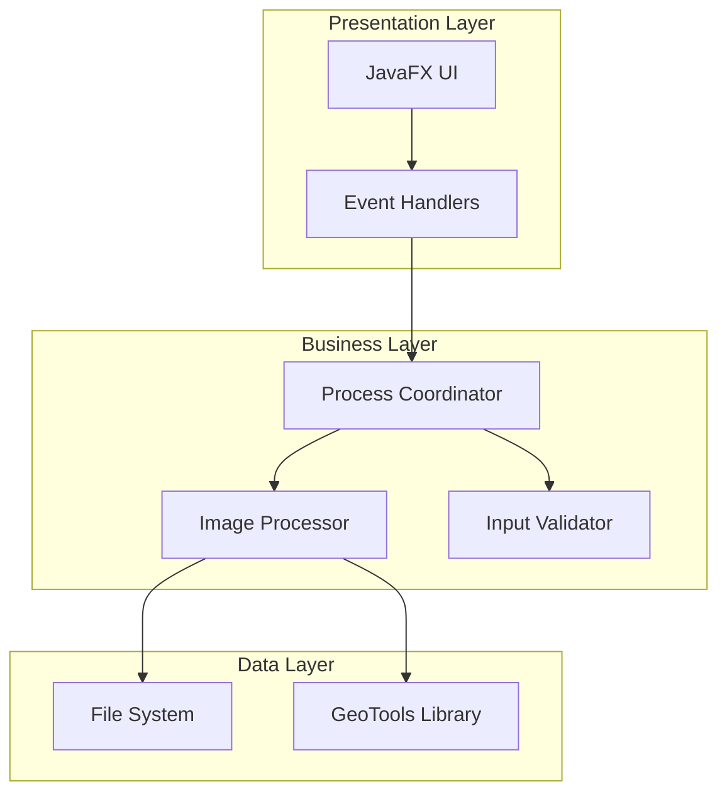
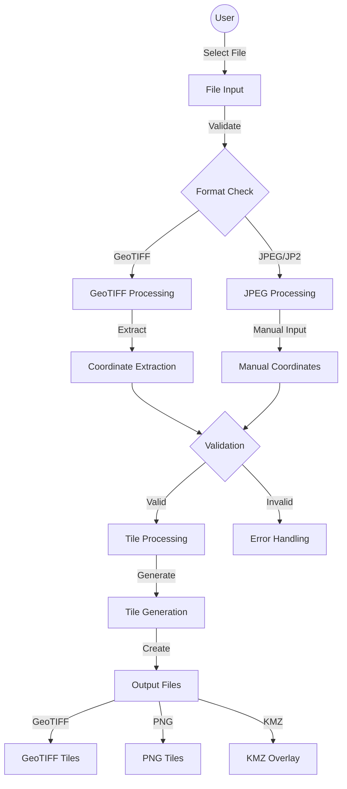
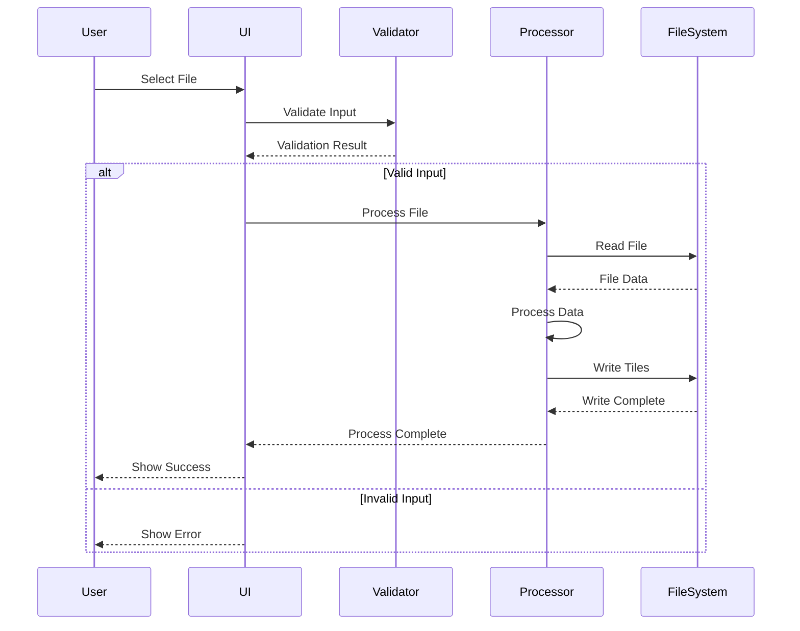
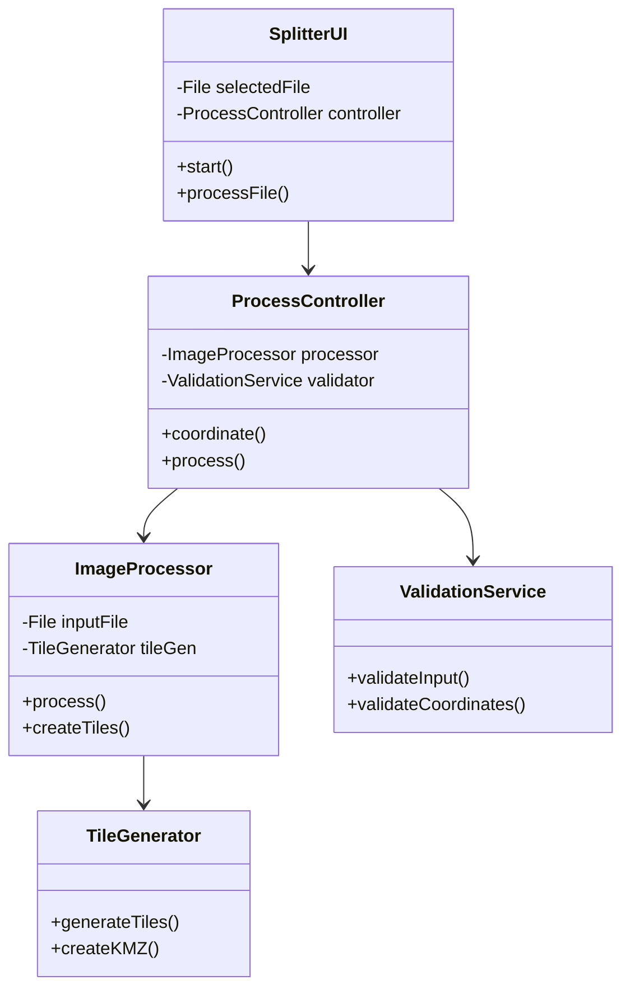
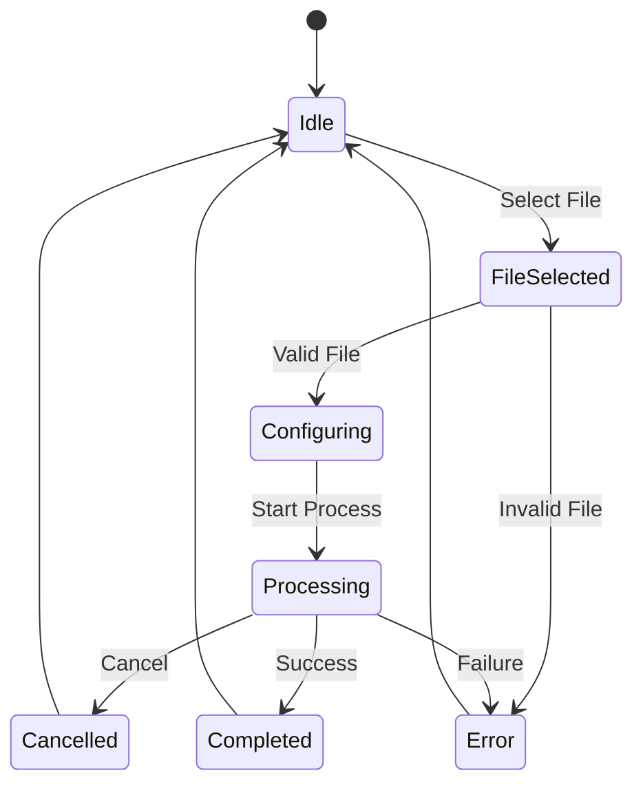
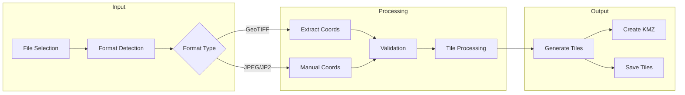
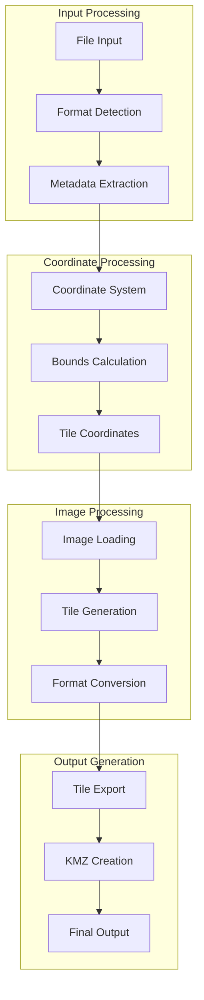
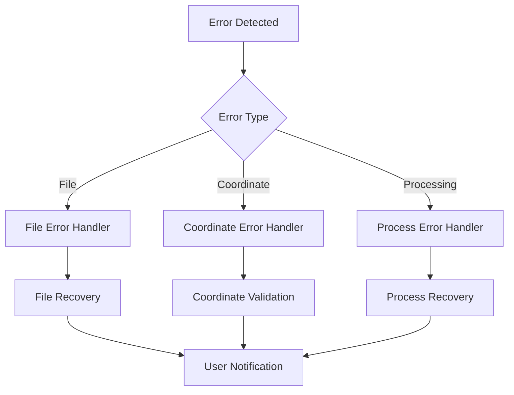

# GeoImage Split 2KMZ Overlay Documentation

## Overview

GeoImage Split 2KMZ Overlay is a specialized Java-based application designed for processing large georeferenced images. It helps GIS professionals and researchers work with large-scale geographic data by splitting them into manageable tiles while preserving geographic coordinates. The application features an intuitive interface with smart coordinate handling, automated calculations, and comprehensive process control capabilities.

## System Architecture

### High-Level Architecture

### Detailed Data Flow Diagram (DFD)

### Component Interaction Diagram

### Class Relationship Diagram

### State Diagram

### Process Flow Diagram

## Features

### 1. File Processing Capabilities
- Support for multiple image formats:
  - GeoTIFF (.tif, .tiff)
  - JPEG2000 (.jp2, .j2k)
  - JPEG (.jpg, .jpeg)
- Intelligent file handling with directory memory
- Default paths to user-friendly locations
- Automatic output directory creation
- Enhanced file format validation
- Improved error handling for file operations

### 2. Smart Coordinate Handling
- Automatic calculation of MAX coordinates
- Real-time coordinate suggestions
  - Adds ~1km offset (0.25 degrees) automatically
  - Updates MAX values when MIN values change
- Manual override capability for all coordinates
- Comprehensive coordinate validation
  - Ensures valid number inputs
  - Verifies MAX values are greater than MIN values
  - Real-time validation feedback
- Special handling for non-georeferenced formats
- Improved error messages for invalid inputs

### 3. Tile Processing
- Configurable tile dimensions (X and Y)
- Multiple output formats:
  - GeoTIFF Tiles
  - PNG Tiles
- Compression options:
  - LZW
  - DEFLATE
  - NONE
- Adjustable tile opacity with precise +/- controls
- Enhanced progress monitoring
- Improved error handling during processing

### 4. Process Control
- Real-time progress monitoring
- Enhanced cancel capability for long-running operations
- Detailed status feedback
- Background processing with UI updates
- Proper thread management
- Safe process termination
- Improved error recovery

### 5. User Interface
- Modern, responsive design
- Dynamic window sizing
- Centered control buttons
- Improved opacity control with +/- buttons
- Enhanced status indicators
- Dedicated cancel button
- Removed scrollbars for better UX
- Better visual feedback during operations

### 6. Coordinate Systems Support
- Multiple CRS options:
  - WGS 84 (EPSG:4326)
  - Web Mercator (EPSG:3857)
  - UTM zones (32643-32646)
- Custom CRS support
- Automatic CRS validation
- Improved error handling for CRS operations

## How to Use

### 1. File Selection
1. Click 'Select File' button
2. Navigate to your image directory (remembers last used location)
3. Choose your input file from supported formats
4. Application automatically selects appropriate handling based on format

### 2. Configure Settings
1. Set number of tiles (X and Y)
2. Choose target coordinate system
3. Adjust tile opacity using + and - buttons
4. Select output format
5. Choose compression method
6. Verify all settings before processing

### 3. Coordinate Input
- For GeoTIFF files:
  1. Coordinates are automatically extracted
  2. Manual override available if needed
  3. Validation ensures coordinate integrity

- For JPEG/JP2 files:
  1. Check 'Manual Georeferencing' box
  2. Enter MIN X (West) coordinate
  3. Enter MIN Y (South) coordinate
  4. MAX coordinates will be automatically suggested
  5. Adjust MAX values if needed
  6. Real-time validation ensures accuracy

### 4. Processing
1. Click 'Process' button to start
2. Monitor progress in status area
3. Use 'Cancel' button if needed
4. Wait for completion message
5. Check status messages for any warnings or errors

### 5. Output Files
- Individual tiles: Created in 'output/tiles/' directory
- KMZ file (if selected): Choose save location
- All outputs preserve geographic accuracy
- Automatic output directory management

## Tips and Best Practices

1. **File Selection**
   - The application remembers your last used directory
   - Default location is set to Documents folder
   - Falls back to home directory if Documents unavailable
   - Verify file format compatibility before processing

2. **Coordinate Handling**
   - Let the application calculate MAX coordinates when possible
   - The automatic 1km offset is suitable for most use cases
   - Always verify suggested coordinates for critical applications
   - Use manual override when precise coordinates are required

3. **Processing**
   - Larger tile numbers create smaller individual tiles
   - Monitor status messages for progress
   - Use cancel button for safe process termination
   - Wait for completion before closing the application
   - Check error messages if processing fails

4. **Output**
   - Check output directory for all generated files
   - Use KMZ format for Google Earth compatibility
   - Verify coordinate accuracy in output files
   - Ensure sufficient disk space before processing

## Technical Requirements

- Java Runtime Environment (JRE) 8 or higher
- Minimum 4GB RAM recommended
- Sufficient disk space for output files
- Operating System:
  - Windows 7 or higher
  - macOS 10.10 or higher
  - Linux (major distributions)

## Support

For technical support or feature requests:
- Email: angelsingh2199@gmail.com
- Website: https://br31tech.com
- LinkedIn: https://linkedin.com/in/angel3002

## Version History

### Version 1.1.0 (Latest)
- Added smart coordinate calculation
- Improved UI responsiveness
- Enhanced process control
- Added cancel functionality
- Improved error handling
- Added directory memory feature
- Enhanced help documentation

### Version 1.0.0
- Initial release with core functionality
- Basic coordinate handling
- Multiple format support
- Simple process control
- Basic UI implementation 

## Technical Implementation Details

### File Processing Pipeline

### Error Handling Flow

