# GeoReferenced Image Splitter 2KMZ Overlay Documentation

## Table of Contents
1. [Overview](#overview)
2. [Features](#features)
3. [Components](#components)
4. [Dependencies](#dependencies)
5. [Processing Pipeline](#processing-pipeline)
6. [User Interface Guide](#user-interface-guide)
7. [Output Formats](#output-formats)
8. [Best Practices](#best-practices)
9. [Technical Details](#technical-details)
10. [Application Architecture and Diagrams](#application-architecture-and-diagrams)

## Overview

GeoReferenced Image Splitter 2KMZ Overlay is a specialized Java application designed for processing and splitting large georeferenced images (GeoTIFF) into manageable tiles while preserving geographic coordinates. The application provides options to output tiles in different formats and create KMZ overlays for visualization in Google Earth and other GIS applications.

## Features

- **Image Splitting**: Split large GeoTIFF files into smaller, manageable tiles
- **Coordinate Preservation**: Maintain geographic coordinates and projections
- **Multiple Output Formats**: Generate tiles in GeoTIFF or PNG format
- **KMZ Generation**: Create Google Earth compatible KMZ overlays
- **Opacity Control**: Adjust tile transparency
- **Flexible Tiling**: Customize the number of tiles in X and Y directions
- **CRS Support**: Multiple coordinate reference systems supported
- **Modern UI**: User-friendly JavaFX interface

## Components

### 1. User Interface (`SplitterUI.java`)
- **Main Window**: 600x600 pixel window with organized sections
- **File Selection**: Choose input GeoTIFF files
- **Settings Panel**: Configure processing parameters
- **Status Display**: Real-time processing feedback
- **Help & About**: Documentation and developer information

### 2. GeoTIFF Processor (`GeoTiffProcessor.java`)
- Handles reading and processing of GeoTIFF files
- Manages coordinate transformations
- Implements tile generation algorithms
- Creates KMZ overlays with proper georeferencing

### 3. Tile Management (`TileInfo.java`)
- Stores tile metadata and image data
- Manages tile coordinates and bounds
- Handles tile organization and sorting

### 4. KMZ Generation (`createMergedKMZ` method)
- Creates KML structure for geographic overlays
- Manages image transparency and quality
- Handles file compression and organization
- Preserves geographic metadata

## Dependencies

### Core Libraries
```xml
<dependencies>
    <!-- JavaFX - UI Framework -->
    <dependency>
        <groupId>org.openjfx</groupId>
        <artifactId>javafx-controls</artifactId>
        <version>17.0.1</version>
    </dependency>

    <!-- GeoTools - Geospatial Data Handling -->
    <dependency>
        <groupId>org.geotools</groupId>
        <artifactId>gt-main</artifactId>
        <version>27.0</version>
    </dependency>
    <dependency>
        <groupId>org.geotools</groupId>
        <artifactId>gt-geotiff</artifactId>
        <version>27.0</version>
    </dependency>
</dependencies>
```

## Processing Pipeline

1. **File Loading**
   - Read GeoTIFF input file
   - Extract coordinate reference system
   - Load image data and metadata

2. **Coordinate Processing**
   - Identify source CRS
   - Transform coordinates if needed
   - Calculate tile boundaries

3. **Image Splitting**
   - Calculate tile dimensions
   - Create tile grid
   - Process each tile while preserving georeferencing
   - Apply opacity settings

4. **Output Generation**
   - Save tiles in selected format
   - Generate KMZ overlay if requested
   - Organize output files

## User Interface Guide

### Settings Section
1. **Target CRS**
   - Choose from common coordinate systems
   - Supports EPSG:4326 (WGS 84)
   - Web Mercator and UTM zones available

2. **Tile Configuration**
   - Set number of tiles in X direction
   - Set number of tiles in Y direction
   - Automatically calculates optimal tile sizes

3. **Output Format**
   - GeoTIFF Tiles: Preserves geographic information
   - PNG Tiles: Lightweight, suitable for web use

4. **Opacity Control**
   - Adjust transparency from 0-100%
   - Applied to both tiles and KMZ overlay

5. **KMZ Options**
   - Create KMZ overlay for Google Earth
   - Combines all tiles into single overlay
   - Preserves geographic positioning

## Output Formats

### 1. GeoTIFF Tiles
- Maintains coordinate reference system
- Preserves geographic metadata
- Suitable for GIS applications
- Full quality preservation

### 2. PNG Tiles
- Lightweight image format
- Supports transparency
- Web-friendly format
- Reduced file size

### 3. KMZ Overlay
- Google Earth compatible
- Contains all tiles properly positioned
- Includes transparency settings
- Easy to share and view

## Best Practices

1. **Input Files**
   - Use properly georeferenced GeoTIFF files
   - Ensure input file has valid CRS information
   - Verify file permissions

2. **Tile Settings**
   - Choose tile numbers based on image size
   - Consider memory limitations
   - Balance between tile size and quantity

3. **Output Management**
   - Organize output in separate directories
   - Use meaningful file names
   - Backup original files

## Technical Details

### GeoTIFF Processing and KMZ Generation

#### 1. GeoTIFF Reading and Analysis
```java
// Initial processing of GeoTIFF file
public void process() {
    // Initialize EPSG database and CRS handling
    System.setProperty("org.geotools.referencing.forceXY", "true");
    GeoTiffReader reader = new GeoTiffReader(geoTiffFile);
    
    // Extract essential geographic information
    coverage = reader.read(null);
    bounds = coverage.getEnvelope2D();
    sourceCRS = coverage.getCoordinateReferenceSystem();
}
```

#### 2. Tile Generation Process
1. **Image Analysis**
   - Read source GeoTIFF dimensions
   - Calculate optimal tile sizes
   - Determine geographic bounds
   ```java
   int fullWidth = sourceImage.getWidth();
   int fullHeight = sourceImage.getHeight();
   int tileWidth = (int) Math.ceil((double) fullWidth / numTilesX);
   int tileHeight = (int) Math.ceil((double) fullHeight / numTilesY);
   ```

2. **Geographic Calculations**
   - Calculate geographic dimensions for each tile
   - Preserve coordinate reference system
   ```java
   double fullGeoWidth = bounds.getMaxX() - bounds.getMinX();
   double fullGeoHeight = bounds.getMaxY() - bounds.getMinY();
   double tileGeoWidth = fullGeoWidth / numTilesX;
   double tileGeoHeight = fullGeoHeight / numTilesY;
   ```

3. **Tile Creation**
   - Extract tile images
   - Apply transparency settings
   - Preserve geographic metadata
   ```java
   BufferedImage tileImage = sourceBuffered.getSubimage(
       startX, startY, currentTileWidth, currentTileHeight
   );
   tileImage = applyOpacity(tileImage);
   ```

#### 3. KMZ Generation Process

1. **KML Structure Creation**
```xml
<?xml version="1.0" encoding="UTF-8"?>
<kml xmlns="http://www.opengis.net/kml/2.2">
  <Document>
    <name>Merged GeoTIFF</name>
    <description>Generated from source.tif</description>
    <GroundOverlay>
      <name>Tile 0</name>
      <Icon>
        <href>tiles/0.png</href>
      </Icon>
      <LatLonBox>
        <north>latitude_north</north>
        <south>latitude_south</south>
        <east>longitude_east</east>
        <west>longitude_west</west>
      </LatLonBox>
    </GroundOverlay>
    <!-- Additional tiles... -->
  </Document>
</kml>
```

2. **Tile Processing for KMZ**
   - Convert tiles to PNG format
   - Apply opacity settings
   - Organize in temporary directory
   ```java
   // Create PNG with transparency
   BufferedImage pngImage = new BufferedImage(
       tile.getWidth(),
       tile.getHeight(),
       BufferedImage.TYPE_INT_ARGB
   );
   
   // Apply opacity if needed
   if (tileOpacity < 1.0f) {
       g.setComposite(AlphaComposite.getInstance(
           AlphaComposite.SRC_OVER, 
           tileOpacity
       ));
   }
   ```

3. **KMZ File Assembly**
   - Create ZIP structure
   - Add KML document
   - Include processed tiles
   ```java
   try (ZipOutputStream zos = new ZipOutputStream(
       new FileOutputStream(outputPath)
   )) {
       // Add KML first
       addFileToZip(zos, kmlFile, "doc.kml");
       
       // Add tile images
       for (File file : tileFiles) {
           addFileToZip(
               zos, 
               file, 
               "tiles/" + file.getName()
           );
       }
   }
   ```

#### 4. Overlay Options and Settings

1. **Opacity Control**
   - User-defined transparency (0-100%)
   - Applied at both tile and KMZ level
   ```java
   public void setTileOpacity(float opacity) {
       this.tileOpacity = Math.max(0.0f, Math.min(1.0f, opacity));
   }
   ```

2. **Geographic Positioning**
   - Precise coordinate mapping
   - Automatic tile arrangement
   ```java
   // Calculate tile bounds
   double minX = bounds.getMinX() + (x * tileGeoWidth);
   double maxX = minX + tileGeoWidth;
   double maxY = bounds.getMaxY() - (y * tileGeoHeight);
   double minY = maxY - tileGeoHeight;
   ```

3. **Quality Settings**
   - High-quality image processing
   - Bilinear interpolation
   - Anti-aliasing
   ```java
   Graphics2D g = pngImage.createGraphics();
   g.setRenderingHint(
       RenderingHints.KEY_INTERPOLATION, 
       RenderingHints.VALUE_INTERPOLATION_BILINEAR
   );
   g.setRenderingHint(
       RenderingHints.KEY_RENDERING, 
       RenderingHints.VALUE_RENDER_QUALITY
   );
   g.setRenderingHint(
       RenderingHints.KEY_ANTIALIASING, 
       RenderingHints.VALUE_ANTIALIAS_ON
   );
   ```

#### 5. Output Organization

1. **Directory Structure**
```
output/
├── tiles/           # Individual tile storage
│   ├── tile_0_0.tif # Original format tiles
│   └── tile_0_1.tif
├── temp_kmz/        # Temporary processing
│   ├── doc.kml      # KML document
│   └── tiles/       # PNG versions for KMZ
└── overlay.kmz      # Final KMZ output
```

2. **File Naming Convention**
- Tiles: `tile_row_column.extension`
- KMZ: `overlay.kmz`
- Internal KMZ structure preserved

## Developer Information

- **Developer**: Angel (Mehul) Singh
- **Email**: angelsingh2199@gmail.com
- **Company**: BR31 - Technologies Pvt. Ltd.
- **Website**: https://br31tech.com
- **LinkedIn**: https://linkedin.com/in/angel3002

## Support and Updates

The application is actively maintained and supported. For issues, feature requests, or contributions:
1. Contact developer via email
2. Visit the company website
3. Create issues on the GitHub repository
4. Check for regular updates

This documentation provides a comprehensive overview of the application's capabilities, components, and usage. For specific technical questions or support, please contact the development team.

## Application Architecture and Diagrams

### System Flow Chart

```mermaid
%%{init: {'theme': 'base', 'themeVariables': { 'primaryColor': '#32CD32', 'edgeLabelBackground':'#FFFFFF', 'tertiaryColor': '#fff0f0'}}}%%
flowchart TD
    style Start fill:#32CD32,stroke:#006400,stroke-width:2px
    style Complete fill:#32CD32,stroke:#006400,stroke-width:2px
    style ShowError fill:#FF6B6B,stroke:#CC0000,stroke-width:2px
    style KMZOption fill:#FFD700,stroke:#B8860B,stroke-width:2px

    Start([🚀 Start]) --> InputFile[/📂 Select GeoTIFF File/]
    InputFile --> ValidateFile{Valid File?}
    ValidateFile -->|No| ShowError[❌ Show Error]
    ShowError --> InputFile
    ValidateFile -->|Yes| ConfigureSettings[⚙️ Configure Settings]
    ConfigureSettings --> ProcessSettings[/Process Settings/]
    ProcessSettings --> SplitImage[🔄 Split Image]
    SplitImage --> SaveTiles[💾 Save Tiles]
    SaveTiles --> KMZOption{Create KMZ?}
    KMZOption -->|Yes| CreateKMZ[📦 Generate KMZ]
    KMZOption -->|No| Complete
    CreateKMZ --> Complete([✅ Complete])

    classDef default fill:#f9f9f9,stroke:#333,stroke-width:2px;
    classDef process fill:#BBE5F3,stroke:#0099CC,stroke-width:2px;
    classDef decision fill:#FFE5CC,stroke:#FF9933,stroke-width:2px;
    
    class InputFile,ProcessSettings,SplitImage,SaveTiles,CreateKMZ process;
    class ValidateFile,KMZOption decision;
```


### Data Flow Diagram (Level 0)

```mermaid
%%{init: {'theme': 'base', 'themeVariables': { 'primaryColor': '#3498db', 'lineColor': '#2ecc71'}}}%%
flowchart LR
    subgraph User Operations
        User((👤 User))
    end
    
    subgraph Core Process
        Process[GeoTIFF Splitter]
    end
    
    User -->|📂 Input GeoTIFF| Process
    Process -->|🗂️ Tiles| User
    Process -->|📦 KMZ Overlay| User
    Process -->|📊 Status| User
    User -->|⚙️ Settings| Process

    style Process fill:#3498db,stroke:#2980b9,stroke-width:2px
    style User fill:#e74c3c,stroke:#c0392b,stroke-width:2px
```


### Component Architecture


### Sequence Diagram


### Class Relationship Diagram


### Data Structure (ER)


### Processing Pipeline

```mermaid
%%{init: {'theme': 'base', 'themeVariables': { 'primaryColor': '#2ecc71', 'secondaryColor': '#3498db', 'tertiaryColor': '#e74c3c'}}}%%
graph LR
    subgraph Input
        A[📂 GeoTIFF Input] --> B[🔍 Validate]
    end
    
    subgraph Processing
        B --> C{⚙️ Process}
        C --> D[✂️ Split Tiles]
        D --> E[💾 Save]
    end
    
    subgraph Output
        E --> F{📤 Format}
        F -->|GeoTIFF| G[🗺️ GeoTIFF Tiles]
        F -->|PNG| H[🖼️ PNG Tiles]
        G & H --> I{📦 KMZ?}
        I -->|Yes| J[📄 Generate KML]
        J --> K[🎁 Package KMZ]
        I -->|No| L[✅ Complete]
        K --> L
    end

    classDef input fill:#2ecc71,stroke:#27ae60,color:white;
    classDef process fill:#3498db,stroke:#2980b9,color:white;
    classDef output fill:#e74c3c,stroke:#c0392b,color:white;
    classDef decision fill:#f1c40f,stroke:#f39c12,color:black;

    class A,B input;
    class C,D,E process;
    class G,H,J,K,L output;
    class F,I decision;
```


These enhanced diagrams feature:
- Consistent color schemes
- Icons and emojis for better visualization
- Clear grouping and subgraphs
- Improved typography and styling
- Better visual hierarchy
- Detailed relationships and flows
- Professional-looking design elements

The diagrams use Mermaid's advanced features:
- Theme initialization
- Custom styling
- Direction controls
- Subgraphs
- Icons and emojis
- Color schemes
- Advanced layouts

Each diagram is now more visually appealing and easier to understand while maintaining its technical accuracy. 