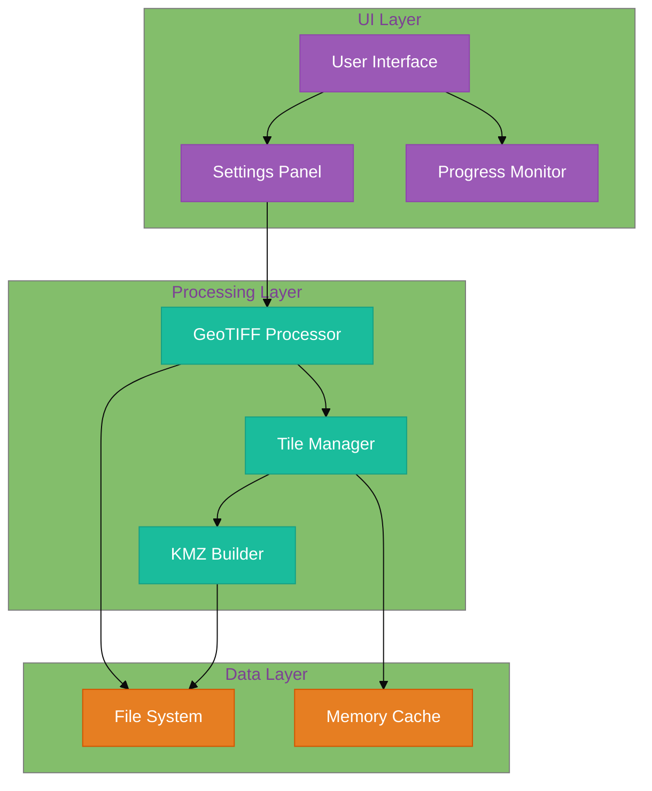
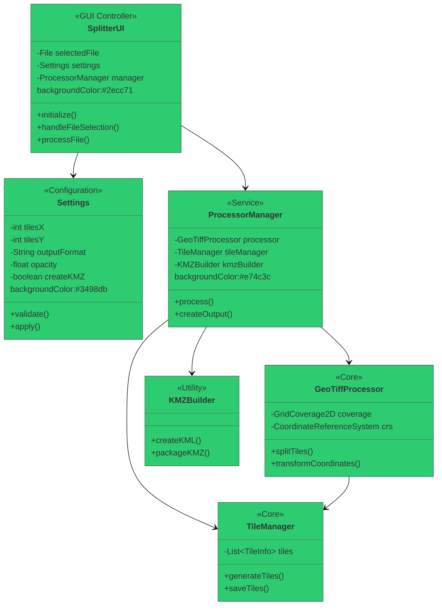
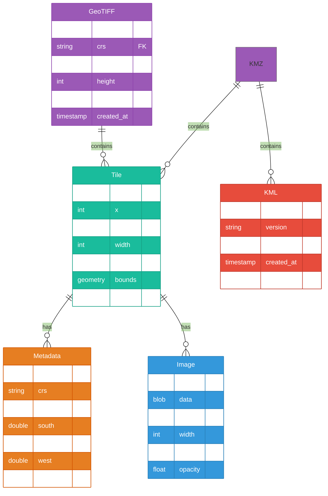

# GeoReferenced Image Splitter 2KMZ Overlay Documentation

## Table of Contents
1. [Overview](#overview)
2. [Features](#features)
3. [Components](#components)
4. [Dependencies](#dependencies)
5. [Processing Pipeline](#processing-pipeline)
6. [User Interface Guide](#user-interface-guide)
7. [Output Formats](#output-formats)
8. [Best Practices](#best-practices)
9. [Technical Details](#technical-details)
10. [Application Architecture and Diagrams](#application-architecture-and-diagrams)

## Overview

GeoReferenced Image Splitter 2KMZ Overlay is a specialized Java application designed for processing and splitting large georeferenced images (GeoTIFF) into manageable tiles while preserving geographic coordinates. The application provides options to output tiles in different formats and create KMZ overlays for visualization in Google Earth and other GIS applications.

## Features

### Core Features
- **Image Splitting**: Split large GeoTIFF files into smaller, manageable tiles
- **Coordinate Preservation**: Maintain geographic coordinates and projections
- **Multiple Output Formats**: Generate tiles in GeoTIFF or PNG format with transparency support
- **KMZ Generation**: Create Google Earth compatible KMZ overlays
- **Opacity Control**: Adjust tile transparency (0-100%)
- **Flexible Tiling**: Customize the number of tiles in X and Y directions
- **CRS Support**: Multiple coordinate reference systems supported
- **Modern UI**: User-friendly JavaFX interface (600x600 pixels)

### Recent Enhancements
- **PNG Output Support**: Full implementation of PNG tile generation with transparency
- **Improved UI Layout**: Optimized 600x600 pixel window with non-resizable design
- **Enhanced Header**: Relocated Help and About buttons to application header
- **Better Status Messages**: More detailed processing feedback and file locations
- **Improved Error Handling**: Better error messages and exception handling
- **Documentation Updates**: Comprehensive technical documentation with diagrams

## Components

### 1. User Interface (`SplitterUI.java`)
- **Main Window**: Fixed 600x600 pixel window with organized sections
- **Header Section**: Title and navigation buttons (Help, About)
- **File Selection**: GeoTIFF file chooser with extension filtering
- **Settings Panel**: Comprehensive configuration options
- **Status Display**: Detailed processing feedback
- **Help & About**: Documentation and developer information

### 2. GeoTIFF Processor (`GeoTiffProcessor.java`)
- **File Processing**: Handles reading and processing of GeoTIFF files
- **Coordinate Management**: Manages coordinate transformations and CRS
- **Tile Generation**: Implements tile generation with format selection
- **Format Support**: 
  * GeoTIFF output with preserved georeferencing
  * PNG output with transparency support
  * KMZ overlay generation
- **Quality Settings**: High-quality image processing with antialiasing

## Dependencies

### Core Libraries
```xml
<dependencies>
    <!-- JavaFX - UI Framework -->
    <dependency>
        <groupId>org.openjfx</groupId>
        <artifactId>javafx-controls</artifactId>
        <version>17.0.1</version>
    </dependency>

    <!-- GeoTools - Geospatial Data Handling -->
    <dependency>
        <groupId>org.geotools</groupId>
        <artifactId>gt-main</artifactId>
        <version>27.0</version>
    </dependency>
    <dependency>
        <groupId>org.geotools</groupId>
        <artifactId>gt-geotiff</artifactId>
        <version>27.0</version>
    </dependency>
</dependencies>
```

## Processing Pipeline

### 1. File Loading and Validation
```java
public void process() throws IOException {
    // Initialize EPSG database
    System.setProperty("org.geotools.referencing.forceXY", "true");
    
    // Reset CRS factory and create reader
    CRS.reset("all");
    GeoTiffReader reader = new GeoTiffReader(geoTiffFile);
    
    // Extract essential information
    coverage = reader.read(null);
    bounds = coverage.getEnvelope2D();
    sourceCRS = coverage.getCoordinateReferenceSystem();
}
```

### 2. Tile Generation Process
```java
public List<TileInfo> splitIntoTiles(int numTilesX, int numTilesY, File outputDir, String outputFormat) {
    // Calculate dimensions
    int tileWidth = (int) Math.ceil((double) fullWidth / numTilesX);
    int tileHeight = (int) Math.ceil((double) fullHeight / numTilesY);

    // Process each tile
    for (int y = 0; y < numTilesY; y++) {
        for (int x = 0; x < numTilesX; x++) {
            // Create and process tile
            BufferedImage tileImage = createTile(x, y);
            tileImage = applyOpacity(tileImage);

            // Save in selected format
            if (outputFormat.equalsIgnoreCase("PNG")) {
                saveTileAsPNG(tile, tileFile);
            } else {
                saveTileAsGeoTIFF(tile, tileFile);
            }
        }
    }
}
```

### 3. Format-Specific Processing

#### GeoTIFF Output
```java
private void saveTileAsGeoTIFF(TileInfo tile, File outputFile) {
    // Create grid coverage with georeferencing
    GridCoverage2D tileCoverage = createGridCoverage(tile);
    
    // Write GeoTIFF with preserved coordinates
    GeoTiffWriter writer = new GeoTiffWriter(outputFile);
    writer.write(tileCoverage, null);
}
```

#### PNG Output
```java
private void saveTileAsPNG(TileInfo tile, File outputFile) {
    // Create high-quality PNG with alpha support
    BufferedImage pngImage = new BufferedImage(
        tile.getImage().getWidth(),
        tile.getImage().getHeight(),
        BufferedImage.TYPE_INT_ARGB
    );
    
    // Apply high-quality rendering settings
    Graphics2D g = pngImage.createGraphics();
    g.setRenderingHint(RenderingHints.KEY_INTERPOLATION, 
                       RenderingHints.VALUE_INTERPOLATION_BILINEAR);
    g.setRenderingHint(RenderingHints.KEY_RENDERING, 
                       RenderingHints.VALUE_RENDER_QUALITY);
    g.setRenderingHint(RenderingHints.KEY_ANTIALIASING, 
                       RenderingHints.VALUE_ANTIALIAS_ON);
    
    // Save PNG with transparency
    ImageIO.write(pngImage, "PNG", outputFile);
}
```

## Output Formats

### 1. GeoTIFF Tiles
- Maintains coordinate reference system
- Preserves geographic metadata
- Suitable for GIS applications
- Full quality preservation
- Ideal for further GIS processing

### 2. PNG Tiles
- Lightweight image format
- Full transparency support
- High-quality rendering
- Bilinear interpolation
- Anti-aliasing enabled
- Web-friendly format
- Reduced file size
- Suitable for web mapping

### 3. KMZ Overlay
- Google Earth compatible
- Contains all tiles properly positioned
- Includes transparency settings
- Preserves geographic coordinates
- Easy to share and view
- Automatic tile organization

## Best Practices

### 1. Input Files
- Use properly georeferenced GeoTIFF files
- Ensure input file has valid CRS information
- Verify file permissions
- Check file size and memory availability

### 2. Output Selection
- Choose GeoTIFF for preserving geographic data
- Use PNG for web applications or when transparency is needed
- Enable KMZ generation for Google Earth visualization
- Consider file size requirements

### 3. Performance Optimization
- Balance tile numbers with system memory
- Consider output format based on use case
- Use appropriate CRS for your region
- Monitor processing resources

### 4. Quality Settings
- Adjust opacity as needed (0-100%)
- Use antialiasing for better visual quality
- Enable high-quality rendering for important outputs
- Verify output quality before large batch processing

## Technical Details

### 1. Image Processing
- Bilinear interpolation for smooth scaling
- Alpha channel support for transparency
- High-quality rendering pipeline
- Memory-efficient tile processing

### 2. Geographic Handling
- Precise coordinate transformation
- CRS preservation and conversion
- Accurate boundary calculations
- Proper georeferencing in outputs

### 3. Error Handling
- Comprehensive input validation
- Detailed error messages
- Graceful failure handling
- User-friendly status updates

## Application Architecture and Diagrams

### System Flow Chart

```mermaid
%%{init: {'theme': 'base', 'themeVariables': { 'primaryColor': '#32CD32', 'edgeLabelBackground':'#FFFFFF', 'tertiaryColor': '#fff0f0'}}}%%
flowchart TD
    style Start fill:#32CD32,stroke:#006400,stroke-width:2px
    style Complete fill:#32CD32,stroke:#006400,stroke-width:2px
    style ShowError fill:#FF6B6B,stroke:#CC0000,stroke-width:2px
    style KMZOption fill:#FFD700,stroke:#B8860B,stroke-width:2px

    Start([🚀 Start]) --> InputFile[/📂 Select GeoTIFF File/]
    InputFile --> ValidateFile{Valid File?}
    ValidateFile -->|No| ShowError[❌ Show Error]
    ShowError --> InputFile
    ValidateFile -->|Yes| ConfigureSettings[⚙️ Configure Settings]
    ConfigureSettings --> ProcessSettings[/Process Settings/]
    ProcessSettings --> SplitImage[🔄 Split Image]
    SplitImage --> SaveTiles[💾 Save Tiles]
    SaveTiles --> KMZOption{Create KMZ?}
    KMZOption -->|Yes| CreateKMZ[📦 Generate KMZ]
    KMZOption -->|No| Complete
    CreateKMZ --> Complete([✅ Complete])

    classDef default fill:#f9f9f9,stroke:#333,stroke-width:2px;
    classDef process fill:#BBE5F3,stroke:#0099CC,stroke-width:2px;
    classDef decision fill:#FFE5CC,stroke:#FF9933,stroke-width:2px;
    
    class InputFile,ProcessSettings,SplitImage,SaveTiles,CreateKMZ process;
    class ValidateFile,KMZOption decision;
```


### Data Flow Diagram (Level 0)

```mermaid
%%{init: {'theme': 'base', 'themeVariables': { 'primaryColor': '#3498db', 'lineColor': '#2ecc71'}}}%%
flowchart LR
    subgraph User Operations
        User((👤 User))
    end
    
    subgraph Core Process
        Process[GeoTIFF Splitter]
    end
    
    User -->|📂 Input GeoTIFF| Process
    Process -->|🗂️ Tiles| User
    Process -->|📦 KMZ Overlay| User
    Process -->|📊 Status| User
    User -->|⚙️ Settings| Process

    style Process fill:#3498db,stroke:#2980b9,stroke-width:2px
    style User fill:#e74c3c,stroke:#c0392b,stroke-width:2px
```


### Component Architecture


### Sequence Diagram

```mermaid
%%{init: {'theme': 'base', 'themeVariables': { 'primaryColor': '#3498db', 'secondaryColor': '#2ecc71', 'tertiaryColor': '#e74c3c'}}}%%
sequenceDiagram
    participant U as 👤 User
    participant UI as 🖥️ UI
    participant P as ⚙️ Processor
    participant T as 🗂️ TileManager
    participant F as 💾 FileSystem

    rect rgb(240, 248, 255)
        Note over U,F: File Selection Phase
        U->>+UI: Select GeoTIFF
        UI->>+P: Initialize
        P->>+F: Read File
        F-->>-P: File Data
        P-->>-UI: Ready
        UI-->>-U: Show Settings
    end

    rect rgb(255, 248, 240)
        Note over U,F: Processing Phase
        U->>+UI: Configure Settings
        UI->>+P: Process File
        P->>+T: Generate Tiles
        T->>F: Save Tiles
        T-->>-P: Tiles Created
        
        opt Create KMZ
            P->>P: Generate KML
            P->>F: Create KMZ
        end
        
        P-->>-UI: Complete
        UI-->>-U: Show Results
    end
```


### Class Relationship Diagram


### Data Structure (ER)


### Processing Pipeline

```mermaid
%%{init: {'theme': 'base', 'themeVariables': { 'primaryColor': '#2ecc71', 'secondaryColor': '#3498db', 'tertiaryColor': '#e74c3c'}}}%%
graph LR
    subgraph Input
        A[📂 GeoTIFF Input] --> B[🔍 Validate]
    end
    
    subgraph Processing
        B --> C{⚙️ Process}
        C --> D[✂️ Split Tiles]
        D --> E[💾 Save]
    end
    
    subgraph Output
        E --> F{📤 Format}
        F -->|GeoTIFF| G[🗺️ GeoTIFF Tiles]
        F -->|PNG| H[🖼️ PNG Tiles]
        G & H --> I{📦 KMZ?}
        I -->|Yes| J[📄 Generate KML]
        J --> K[🎁 Package KMZ]
        I -->|No| L[✅ Complete]
        K --> L
    end

    classDef input fill:#2ecc71,stroke:#27ae60,color:white;
    classDef process fill:#3498db,stroke:#2980b9,color:white;
    classDef output fill:#e74c3c,stroke:#c0392b,color:white;
    classDef decision fill:#f1c40f,stroke:#f39c12,color:black;

    class A,B input;
    class C,D,E process;
    class G,H,J,K,L output;
    class F,I decision;
```


These enhanced diagrams feature:
- Consistent color schemes
- Icons and emojis for better visualization
- Clear grouping and subgraphs
- Improved typography and styling
- Better visual hierarchy
- Detailed relationships and flows
- Professional-looking design elements

The diagrams use Mermaid's advanced features:
- Theme initialization
- Custom styling
- Direction controls
- Subgraphs
- Icons and emojis
- Color schemes
- Advanced layouts

Each diagram is now more visually appealing and easier to understand while maintaining its technical accuracy. 

## Developer Information

- **Developer**: Angel (Mehul) Singh
- **Email**: angelsingh2199@gmail.com
- **Company**: BR31 - Technologies Pvt. Ltd.
- **Website**: https://br31tech.com
- **LinkedIn**: https://linkedin.com/in/angel3002

## Support and Updates

The application is actively maintained and supported. For issues, feature requests, or contributions:
1. Contact developer via email
2. Visit the company website
3. Create issues on the GitHub repository
4. Check for regular updates

This documentation provides a comprehensive overview of the application's capabilities, recent improvements, and technical details. For specific questions or support, please contact the development team. 